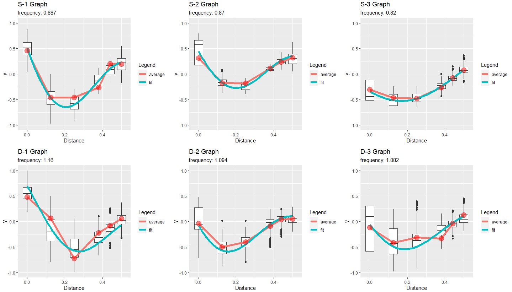
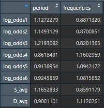
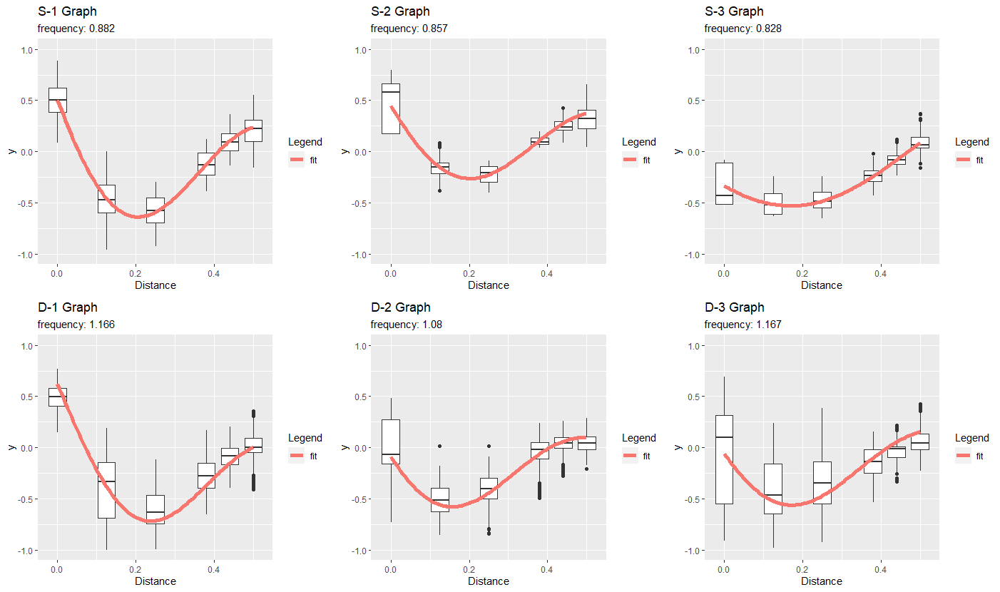

# Bootstrap Analysis of Substantially-Small Data Sets (2020-2021)
_David Sanchez, davids1lite@gmail.com, high school-level project; Salk Institute for Biological Studies_

R program that analyzes sinusoidal trends in 6 substantially small data sets by [bootstrapping](#Basic-bootstrap-analysis-explanation) 216 data points to generate 36,000 new data points to artificially create a normal/Gaussian distribution for a more accurate approximation of any hidden trend.  Further details of data can be found [here](#Further-details-of-6-data-sets).

#### Analysis details:
> Bootstraps each data set 1,000 times to simulate a normal/Gaussian distribution containing 6,000 new data points total per set for a total of 36,000 new data points  
> Every single bootstrap iteration (1,000 iterations) fits my specific sinusoidal model: y = a * cos(2π * b * x + c) * (1 - d * x).  All 1,000 approximated models per set are averaged into a final model.  _Note: a, b, c, d are variables to be calculated by the model_

#### Produces a graph which contains:
> A boxplot showing the distribution of the 36,000 bootstrapped data points (1,000 per data point, 5,000 per set), including quartile ranges and outliers for each  individual data point (alpha 0.05)   
> 36 averaged data points calculated from bootstrapped data points, connected by a linear piecewise function (red line)   
> 6 average sinusoidal models calculated from 6,000 model estimations of bootstrapped data points (1,000 iterations per set, blue line)   
> individual approximated frequencies of each of the 6 average sinusoidal models 

 

## Basic bootstrap analysis explanation 
Bootstrapping, as it is specifically used in this program, is a statistical data analysis technique where data samples are built by randomly selecting (and subsequently replacing) data points in substantially or unusably small data sets.  Analysis is performed upon the resulting data samples producyed by the bootstrap generation by calculating and recording the desired statistics of each data sample, then averaging all calculations of each individual statistic.  Further detail can be found [here](https://machinelearningmastery.com/a-gentle-introduction-to-the-bootstrap-method/#:~:text=The%20bootstrap%20method%20is%20a%20statistical%20technique%20for%20estimating%20quantities,after%20they%20have%20been%20chosen.).  

#### In this program specifically, the following attributes are recorded:

> Amplitude, period, and frequency of each average sinusoidal model   
> 36 total box-plot distributions of bootstrapped points including outlier, quartile ranges, and average of bootstrapped points

 

## Further details of 6 data sets
The 6 data sets were provided by Dr. Sergei Gepshtein of the Salk Institute, of whom I was supervised by.  As a statistical data analysis intern, I did not and did not need to know the origin of the data as my task was to perform sinusoidal analysis upon the sets using bootstrap analysis.  

#### The program's data has the following qualities:

> 6 total data sets; the first 3 data sets (S-1 through S-3) are related, and the last 3 data sets (D-1 through D-3) are related.  S and D data sets share similar qualities but are not inherently related.   
> In each set: 6 data point "ranges" which contain 6 data points each (216 total raw data points in entire program)   
> For each data point range: Distance x-axis placements of x = {0.00, 1.25, 2.5, 3.75, 4.40, 5}; y-value upper bound is 2.0000, y-value lower bound is -2.0000. 

 

## Differences between the two .R files

#### [bootstrap-project-public.R](https://github.com/davchez/Data-Analysis-of-Substantially-Small-Data-Sets/blob/main/bootstrap-project-public.R)
- Contains a runnable version of the data sets which I worked with on my local computer.  Should be able to run from any device since all data points are contained within the file.  Does not truly represent the length of the code
- Produces data file that contains all of the numbers calculated from the sinusoidal average fits per data set
- 6 individual sets containing 6 data ranges each with 36 unique data points collected from Salk Institute data for analysis (216 total raw data points)

 

#### [bootstrap-project-final.R](https://github.com/davchez/Data-Analysis-of-Substantially-Small-Data-Sets/blob/main/bootstrap-project-unusable.R)
- Contains the version which I ran from my computer using personal folder/file paths to reduce the size of the program.  File paths do not work on any other computer; only included to show how compact the code can be
- Accurately reflects the actual length of code
- removes the red linear piecewise function and averaged point per graph from bootstrap-project-public.R.  Only contains the fitted average sinusoidal model

_Runtime between both files are identical._

 

## Runtime issues and other comments
The code is not optimized.  I estimate the runtime to be worse than or equal to O(n^2).  I have no plans to optimize the code.  Regardless, I published the program on GitHub to demonstrate my competency in statistical data analysis and the methods required to perform bootstrap analysis with a sinusoidal model.  This program was created after a year-long program studying a curriculum in R provided but not created by Dr. Sergei Gepshtein.
